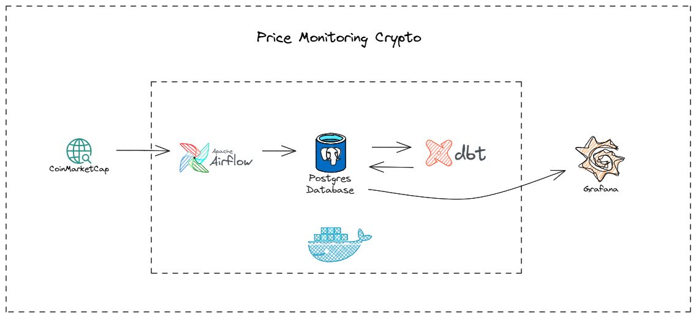
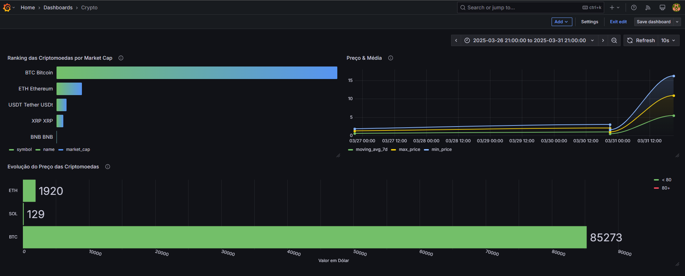
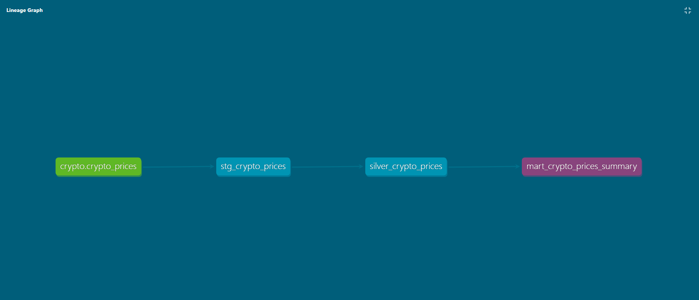

# Monitoramento de Preços de Criptomoedas

Este projeto realiza a coleta, processamento e visualização de dados de preços de criptomoedas utilizando Apache Airflow, PostgreSQL, dbt e Grafana. A arquitetura é baseada em Docker para facilitar a implantação.

## 📌 Visão Geral

A solução coleta dados da API do CoinMarketCap, armazena no PostgreSQL, transforma os dados com dbt e os visualiza no Grafana. Tudo isso é orquestrado pelo Apache Airflow.



## 🚀 Tecnologias Utilizadas

- **Apache Airflow** - Orquestração do pipeline de dados
- **PostgreSQL** - Armazenamento dos dados
- **dbt** - Transformação dos dados
- **Grafana** - Visualização dos dados
- **Docker** - Containerização do projeto

## 🛠️ Configuração e Execução

### 🔧 Pré-requisitos

- Docker e Docker Compose instalados
- Conta na API do CoinMarketCap
- Acesso ao repositório do projeto

### 📦 Instalação

1. Clone o repositório:
   ```sh
   git clone https://github.com/Felipe-M94/price_monitoring_project.git
   cd price_monitoring_project
   ```

2. Configure as variáveis de ambiente no `.env` (caso necessário).

3. Suba os containers Docker:
   ```sh
   docker-compose up -d
   ```

4. Acesse a interface do Airflow:
   - URL: [http://localhost:8080](http://localhost:8080)
   - Usuário: `admin`
   - Senha: `admin`

5. Verifique os dados no PostgreSQL:
   ```sh
   docker exec -it crypto_postgres psql -U crypto_user -d crypto_db
   ```

6. Abra o Grafana para visualizar os dashboards:
   - URL: [http://localhost:3000](http://localhost:3000)
   - Usuário padrão: `admin`
   - Senha padrão: `admin`



## 📊 Estrutura do Projeto

```
price_monitoring_project/
│── dags/                    # DAGs do Apache Airflow
│── dbt/                     # Projetos dbt
│── grafana/                 # Configurações do Grafana
│── images/                  # Imagens para documentação
│── postgres/                # Configurações do PostgreSQL
│── .gitignore               # Arquivos ignorados pelo Git
│── docker-compose.yml       # Configuração dos containers
│── README.md                # Documentação do projeto
```

## 📈 Visualizações

- **Variação de Preços**
- **Média Móvel de 7 Dias**
- **Tendência de Mercado**

## 🔄 Fluxo de Dados

1. Airflow coleta dados da API do CoinMarketCap.
2. PostgreSQL armazena os dados coletados.
3. dbt transforma e prepara os dados.
4. Grafana exibe dashboards interativos.



## 📌 Contribuição

Sinta-se à vontade para contribuir! Faça um fork do repositório e envie um pull request com melhorias.


